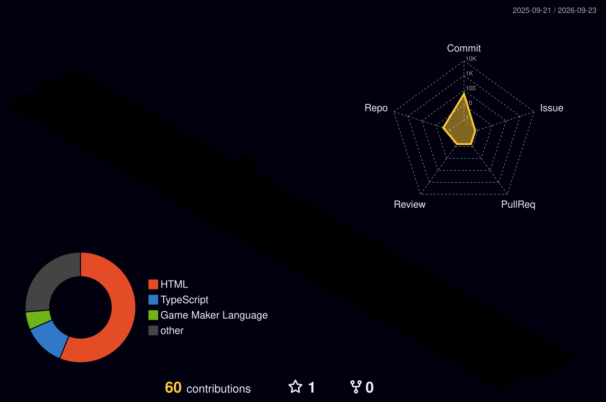

<div align="center">

# 👋 Olá, eu sou Leonardo Moreira


</div>

---

<div align="center">


</div>

# 🚀 Sobre mim

💻 Desenvolvedor Full Stack apaixonado por tecnologia.

Atualmente atuo como **Professor de Robótica e Programação**, ensinando:

- Python
- React
- HTML
- CSS
- JavaScript
- Desenvolvimento de Jogos
- Robótica Educacional

Tenho experiência profissional como **Desenvolvedor Front-end**, trabalhando com:

- Angular
- Ionic

Atualmente estou focado em evoluir cada vez mais no ecossistema Java.

---

# 🎯 Objetivos

- 📚 Aprimorar conhecimentos em Java e Spring Boot
- ☁️ Aprender Cloud Computing
- 🏗️ Arquitetura de Software
- 🧩 Microsserviços
- 🐳 Docker
- 🚀 Conseguir uma oportunidade como Desenvolvedor Full Stack

---

# 🛠️ Tecnologias

<div align="center">


</div>

---

# 📊 Estatísticas

<div align="center">


</div>

---

# 🔥 Sequência de Contribuições

<div align="center">


</div>

---

# 📈 Activity Graph

<div align="center">


</div>

---

# 🏆 GitHub Trophies

<div align="center">


</div>

---

<div align="center">



</div>

<div align="center">


</div>

---

# 💼 Experiência

## 👨‍🏫 Professor de Robótica e Programação

✔ Ensino de lógica de programação

✔ Desenvolvimento Web

✔ Python para Análise de Dados

✔ React

✔ HTML

✔ CSS

✔ JavaScript

✔ Desenvolvimento de Jogos

✔ Robótica Educacional

---

## 💻 Estagiário Front-end

- Angular

- Ionic

- Desenvolvimento Mobile

- Desenvolvimento Web

- Consumo de APIs REST

---

# 🌱 Atualmente estudando

```java
public class Leonardo {

    String[] estudando = {
        "Java",
        "Spring Boot",
        "Docker",
        "AWS",
        "Microsserviços",
        "JUnit",
        "RabbitMQ"
    };

}
```

---

# 📌 Projetos em Destaque

| Projeto | Tecnologias |
|----------|-------------|
| 💻 Portfólio | React |
| 📚 Sistema Escolar | Java |
| 🛒 API REST | Spring Boot |
| 📱 Aplicação Mobile | Ionic + Angular |

---

# 📫 Contato

<div align="center">

<a href="https://www.linkedin.com/in/leomoreiraa/">

</a>

<a href="https://leomoreiraa.github.io/portfolio/">

</a>

<a href="mailto:SEUEMAIL@gmail.com">

</a>

</div>

---

# 💡 Um pouco sobre mim

```text
💻 Desenvolvedor Full Stack

☕ Apaixonado por Java

📚 Professor de Programação

🚀 Sempre estudando novas tecnologias

🎯 Em busca de novos desafios
```

---

<div align="center">


</div>
